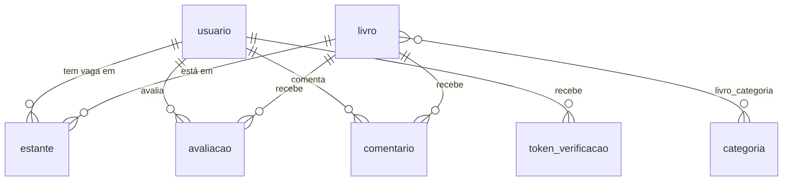

# 📘 Book Manager

Uma estante social completa: catálogo de livros compartilhado, prateleiras por status de leitura, avaliações com resenha, conversa por livro e acompanhamento de progresso. Construída com **Spring Boot** (Java 21) e **Next.js** (React 19) sobre **PostgreSQL**, com o acervo alimentado pela **Google Books API**.

> Desafio técnico full-stack. O escopo pedido — autenticação JWT e CRUD completo de livros — está inteiro na seção [Requisitos do desafio](#-requisitos-do-desafio); o resto do sistema foi construído por cima disso.

> _Ambiente ao vivo:_
> - **Frontend:** _(Vercel — preencher após o deploy)_
> - **API:** _(Render — preencher após o deploy)_
>
> ⏱️ **O primeiro acesso pode levar de 30 a 60 segundos.** Nos planos gratuitos a API hiberna após 15 minutos sem uso e o banco escala a zero; a primeira requisição acorda os dois. Depois disso a navegação é normal.

---

## ✅ Requisitos do desafio

Onde cada item pedido pelo enunciado está implementado:

| Requisito | Implementação | Como verificar |
|---|---|---|
| **Autenticação JWT** | `autenticacao/seguranca/` — `FiltroAutenticacaoJwt` (`OncePerRequestFilter`), `ConfiguracaoSeguranca` (chain stateless), `ServicoTokenJwt` (jjwt) | `POST /auth/login` devolve o token; qualquer rota fora de `/auth/**` sem `Authorization` responde **401** em `application/problem+json` |
| **CRUD completo de livros** | `livro/LivroController` + `LivroService` | `POST /books/create` · `GET /books` · `GET /books/{id}` · `PUT /books/{id}` · `DELETE /books/{id}` |
| **Busca** | `LivroRepository.buscar` (JPQL, `LOWER` + `LIKE`), com índice `ix_livro_titulo` | `GET /books?title=1984` |
| **Paginação** | `RespostaPaginadaDTO` espelhando o `Page` do Spring Data | `GET /books?page=0&size=10&sort=title,asc` |
| **`schema.sql` na raiz** | [`schema.sql`](./schema.sql) — 8 tabelas e 14 índices, espelho das migrations Flyway | `docker compose exec db psql -U bookmanager -d bookmanager -c '\dt'` |
| **Documentação da API** | springdoc-openapi 2.8.6, com security scheme `bearer-jwt` | http://localhost:8080/swagger-ui.html |
| **Frontend consumindo a API** | Next.js App Router, 12 rotas, guarda em `proxy.ts` | http://localhost:3000 |
| **Deploy ao vivo** | Vercel + Render + Neon, blueprint em [`render.yaml`](./render.yaml) | Passo a passo em [`DEPLOY.md`](./DEPLOY.md) |
| **Docker** | `docker-compose.yml` (banco + API + web + caixa de e-mail) | `docker compose up --build` |

**Detalhe de contrato:** o enunciado define os payloads em inglês (`title`, `author`, `year`…) e o código segue a nomenclatura PT-BR do projeto. A ponte é `@JsonProperty` nos DTOs — o contrato HTTP é inglês, o domínio Java é português, sem tradutor manual no meio.

---

## 🚀 Além do escopo

O que foi construído depois de o MVP estar de pé:

| Recurso | O que faz |
|---|---|
| 📥 **Importação do Google Books** | Traz o catálogo real para o banco próprio, em lote e por temas — capa, sinopse, ISBN, editora, idioma, nota. Assíncrona, com progresso consultável e deduplicação por `googleId` |
| 📚 **Estante** | Quatro status (quero ler · lendo · lido · abandonado) + favorito, uma vaga por leitor/livro |
| 📊 **Paginômetro** | Páginas lidas somando livros concluídos integralmente e o progresso parcial de quem está lendo, calculado no banco |
| ⭐ **Avaliações** | Nota de 1 a 5 com resenha opcional e marcação de spoiler; uma por leitor/livro, com média e distribuição das cinco faixas |
| 💬 **Comentários** | Conversa livre em cada livro; o autor remove o próprio, o administrador remove qualquer um e marca spoiler |
| 🔔 **Feed da comunidade** | Resenhas e comentários recentes intercalados por data |
| 🏷️ **Categorias em PT-BR** | Os gêneros vêm em inglês do Google e são traduzidos na apresentação, mantendo o slug como chave estável do filtro |
| 👤 **Conta e administração** | Perfis `USUARIO`/`ADMIN`, edição do próprio cadastro, painel de usuários com troca de perfil e trava do último administrador |
| ✉️ **E-mail transacional** | Confirmação de cadastro e redefinição de senha, com token de uso único guardado como hash |

---

## 🧱 Stack

| Camada | Tecnologias |
|---|---|
| **Backend** | Java 21, Spring Boot 3.4.7, Spring Security, Spring Data JPA, Bean Validation, MapStruct 1.6.3, Flyway, jjwt 0.12.6, springdoc-openapi 2.8.6, Lombok |
| **Frontend** | Next.js 16.2.11 (App Router), React 19.2.4, TypeScript 5, Tailwind CSS v4, TanStack Query 5, React Hook Form 7 + Zod 4, lucide-react |
| **Banco** | PostgreSQL 16 |
| **Infra** | Docker, Docker Compose, Mailpit (SMTP de desenvolvimento) |
| **Testes** | JUnit 5, Mockito, Testcontainers, Spring Security Test, `MockRestServiceServer` |

Dimensão: 106 arquivos Java (~4,6 mil linhas) em 10 pacotes de feature, 75 arquivos TypeScript/TSX (~7,1 mil linhas) em 12 rotas.

---

## 🚀 Como executar

### Pré-requisitos
- [Docker](https://www.docker.com/) e Docker Compose
- (Só para rodar sem Docker) Java 21+ e Node.js 20+

### Opção A — Script `serve.ps1` (Windows/PowerShell, mais fácil)

Sobe tudo (banco + API + frontend + caixa de e-mail), espera ficar pronto e abre o navegador:

```powershell
.\serve.ps1          # ou: .\serve.ps1 up
```

Outros comandos: `down` (parar) · `reset` (zerar dados) · `logs api|web|db` · `status` · `portas` (quem está ocupando 3000/8080/5432) · `dev` (hot reload) · `help`.

#### Comandos globais (opcional)

```powershell
.\instalar-comandos.ps1     # registra as funções no perfil do PowerShell
```

Passam a existir `book-manager-up`, `-down`, `-dev`, `-stop`, `-restart`, `-reset`, `-rebuild`, `-logs`, `-status`, `-portas` e a forma genérica `book-manager <comando>`. Abra uma **nova** janela do PowerShell depois de instalar. Para desfazer: `.\instalar-comandos.ps1 -Remover`.

### Opção B — Docker Compose (qualquer SO)

```bash
docker compose up --build
```

- Frontend: http://localhost:3000
- API: http://localhost:8080
- Swagger UI: http://localhost:8080/swagger-ui.html
- Caixa de e-mail (Mailpit): http://localhost:8025

Para parar: `docker compose down` (ou `down -v` para apagar também os dados).

### Opção C — Ambiente local (hot reload)

```bash
docker compose up -d db mail     # banco e caixa de e-mail
cd backend && ./mvnw spring-boot:run
cd frontend && npm install && npm run dev
```

### Primeiro acesso, passo a passo

O cadastro exige confirmação por e-mail, e alguns recursos são exclusivos de administrador — então a ordem importa:

**1. Crie a conta** em http://localhost:3000 e **confirme pelo Mailpit.** Em desenvolvimento o compose sobe um [Mailpit](https://mailpit.axllent.org/) como servidor SMTP falso: nenhuma mensagem sai para a internet e não é preciso credencial. Abra **http://localhost:8025**, encontre o e-mail e clique no link de confirmação — ele já abre a sessão.

**2. Promova sua conta a administrador.** O primeiro `ADMIN` não existe por padrão; sem ele a tela de usuários, a importação do catálogo e a moderação de spoiler ficam inacessíveis:

```bash
docker compose exec db psql -U bookmanager -d bookmanager \
  -c "UPDATE usuario SET perfil = 'ADMIN' WHERE email = 'seu@email.com';"
```

Saia e entre de novo para o token refletir o novo perfil. Daí em diante a promoção de outras contas é feita pela própria tela `/admin/usuarios`.

**3. Popule o acervo.** Em `/admin/usuarios`, use o painel de importação do Google Books. O acervo nasce vazio de propósito — nenhum dado de mentira é semeado. A importação roda em segundo plano e a tela acompanha o progresso.

Sem chave da API do Google, a importação funciona com a cota reduzida por IP; com chave (gratuita), são mil requisições por dia. Configure em `GOOGLE_BOOKS_API_KEY`.

### Portas

Os padrões são `3000` (web), `8080` (API), `5432` (banco) e `8025` (caixa de e-mail). Se outro projeto já usar alguma delas, copie o `.env.example` para `.env` e ajuste `WEB_PORT`, `API_PORT`, `DB_PORT`, `MAIL_UI_PORT` — junto com `NEXT_PUBLIC_API_URL`, `CORS_ORIGENS` e `APP_URL_BASE`.

O mesmo `.env` define `DB_NAME` (nome do banco criado pelo container, padrão `bookmanager`). Essas seis são lidas pelo Docker Compose, não pela aplicação.

---

## ⚙️ Variáveis de ambiente

Todas têm default de desenvolvimento em `backend/src/main/resources/application.yml`. Há um `.env.example` na raiz (stack completa) e outro em `frontend/` (só a URL da API, para rodar o front isolado).

**Banco e aplicação**

| Variável | Descrição | Padrão |
|---|---|---|
| `DB_URL` | URL JDBC do Postgres | `jdbc:postgresql://localhost:5432/bookmanager` |
| `DB_USERNAME` / `DB_PASSWORD` | Credenciais do banco | `bookmanager` / `bookmanager` |
| `PORT` | Porta HTTP da API | `8080` |
| `SPRING_PROFILES_ACTIVE` | Em `prod`, ativa o fail-fast de segredos | *(vazio)* |
| `CORS_ORIGENS` | Origens permitidas, separadas por vírgula | `http://localhost:3000` |

**Autenticação**

| Variável | Descrição | Padrão |
|---|---|---|
| `JWT_SECRET` | Segredo HMAC, **mínimo 32 bytes** — abaixo disso a aplicação não sobe | *(valor de dev; obrigatório trocar em produção)* |
| `JWT_EXPIRACAO` | Validade do token (ISO-8601 Duration) | `PT8H` |

**E-mail** — `EMAIL_PROVEDOR` escolhe a implementação: `smtp` (Mailpit em dev) ou `brevo` (API HTTP, usada em produção porque o plano gratuito do Render bloqueia as portas SMTP).

| Variável | Descrição | Padrão |
|---|---|---|
| `EMAIL_PROVEDOR` | `smtp` ou `brevo` | `smtp` |
| `MAIL_API_KEY` | Chave da API do Brevo (só com `EMAIL_PROVEDOR=brevo`) | *(vazio)* |
| `MAIL_HOST` / `MAIL_PORT` | Servidor SMTP (só com `EMAIL_PROVEDOR=smtp`) | `localhost` / `1025` |
| `MAIL_USERNAME` / `MAIL_PASSWORD` | Credenciais SMTP | *(vazio)* |
| `MAIL_AUTH` / `MAIL_STARTTLS` | Flags do SMTP | `false` / `false` |
| `MAIL_FROM` / `MAIL_FROM_NOME` | Remetente | `nao-responda@bookmanager.local` / `Book Manager` |
| `APP_URL_BASE` | URL pública do frontend — monta os links dos e-mails | `http://localhost:3000` |

**Google Books**

| Variável | Descrição | Padrão |
|---|---|---|
| `GOOGLE_BOOKS_API_KEY` | Chave da Books API (opcional; sem ela a cota é por IP e bem menor) | *(vazio)* |
| `GOOGLE_BOOKS_URL` | Endpoint da API | `https://www.googleapis.com/books/v1/volumes` |
| `GOOGLE_BOOKS_IDIOMA` | Restringe o idioma dos volumes; vazio = sem restrição | `pt` |
| `GOOGLE_BOOKS_MAX_POR_TEMA` | Teto de livros por tema | `200` |
| `GOOGLE_BOOKS_TEMAS` | Temas a importar (CSV); vazio usa os 20 padrão | *(vazio)* |

**Frontend**

| Variável | Descrição | Padrão |
|---|---|---|
| `NEXT_PUBLIC_API_URL` | URL base da API, lida no browser | `http://localhost:8080` |

---

## 📚 API

Autenticação por `Authorization: Bearer <token>`. Tudo que não estiver marcado como público exige token. Documentação interativa em **`/swagger-ui.html`**.

**Autenticação** — público

| Método | Rota | Descrição |
|---|---|---|
| POST | `/auth/register` | Cria conta e envia o e-mail de confirmação |
| POST | `/auth/login` | Autentica; recusa conta não confirmada com **403** |
| POST | `/auth/confirmar` | Consome o token de confirmação e já abre sessão |
| POST | `/auth/reenviar-confirmacao` | Reenvia a confirmação |
| POST | `/auth/senha/esqueci` | Emite o token de redefinição |
| POST | `/auth/senha/redefinir` | Troca a senha e abre sessão |

> As rotas de reenvio e de "esqueci a senha" respondem sempre a mesma frase neutra, existindo a conta ou não — não servem para descobrir quem está cadastrado.

**Livros e categorias**

| Método | Rota | Auth | Descrição |
|---|---|---|---|
| GET | `/books?title=&category=&page=&size=&sort=` | 🔑 | Lista paginada, já enriquecida com a marcação de estante de quem consulta e a nota da comunidade |
| POST | `/books/create` | 🔑 | Cria livro. **201** + `Location` |
| GET | `/books/{id}` | 🔑 | Detalha o livro com as categorias |
| PUT | `/books/{id}` | 🔒 ADMIN | Atualiza |
| DELETE | `/books/{id}` | 🔒 ADMIN | Soft delete. **204** |
| GET | `/categorias?min=` | 🔑 | Categorias com pelo menos N livros, nome já traduzido |

**Estante**

| Método | Rota | Auth | Descrição |
|---|---|---|---|
| GET | `/shelf?status=&favorites=` | 🔑 | A própria estante, paginada |
| GET | `/shelf/summary` | 🔑 | Contadores por status, favoritos, total e páginas lidas |
| GET | `/books/{id}/shelf` | 🔑 | A própria vaga do livro; **204** se não estiver na estante |
| PUT | `/books/{id}/shelf` | 🔑 | Define status, favorito e progresso |
| DELETE | `/books/{id}/shelf` | 🔑 | Tira da estante. **204** |

**Avaliações e comentários**

| Método | Rota | Auth | Descrição |
|---|---|---|---|
| GET | `/books/{id}/reviews` | 🔑 | Resenhas (só as que têm texto), paginadas |
| GET | `/books/{id}/reviews/summary` | 🔑 | Média e distribuição das cinco faixas |
| GET | `/books/{id}/reviews/mine` | 🔑 | A própria avaliação; **204** se não houver |
| PUT | `/books/{id}/reviews/mine` | 🔑 | Cria ou substitui a própria avaliação |
| DELETE | `/books/{id}/reviews/mine` | 🔑 | Remove a própria avaliação. **204** |
| GET | `/books/{id}/comments` | 🔑 | Conversa paginada |
| POST | `/books/{id}/comments` | 🔑 | Publica comentário. **201** + `Location` |
| DELETE | `/books/{id}/comments/{comentarioId}` | 🔑 autor ou ADMIN | Remove comentário. **204** |
| PATCH | `/books/{id}/comments/{comentarioId}/spoiler?spoiler=` | 🔒 ADMIN | Marca ou desmarca spoiler |
| GET | `/activity?size=` | 🔑 | Feed de resenhas e comentários recentes |

**Conta e administração**

| Método | Rota | Auth | Descrição |
|---|---|---|---|
| GET | `/minha-conta` | 🔑 | Dados da própria conta + `podeAdministrar` |
| PUT | `/minha-conta` | 🔑 | Altera o próprio nome |
| PUT | `/minha-conta/senha` | 🔑 | Troca a senha exigindo a atual. **204** |
| DELETE | `/minha-conta` | 🔑 | Soft delete da própria conta. **204** |
| GET | `/usuarios?busca=` | 🔒 ADMIN | Lista paginada de usuários |
| GET | `/usuarios/{id}` | 🔒 ADMIN | Detalha usuário |
| PUT | `/usuarios/{id}` | 🔒 ADMIN | Altera o nome de qualquer usuário |
| PATCH | `/usuarios/{id}/perfil` | 🔒 ADMIN | Troca o perfil |
| DELETE | `/usuarios/{id}` | 🔒 ADMIN | Soft delete. **204** |

> Duas travas no serviço de usuários: o **último administrador** não pode ser removido nem rebaixado, e o administrador não exclui a própria conta pelo painel (para isso existe `/minha-conta`).

**Integração**

| Método | Rota | Auth | Descrição |
|---|---|---|---|
| POST | `/integracao/importar` | 🔒 ADMIN | Dispara a importação em lote. **202** + progresso; **409** se já houver uma rodando |
| GET | `/integracao/importacao` | 🔒 ADMIN | Acompanha a importação em curso |
| GET | `/integracao/buscar?q=` | 🔑 | Consulta direta ao Google Books |

### Formatos

Erros seguem **[RFC 9457 `ProblemDetail`](https://www.rfc-editor.org/rfc/rfc9457)**, inclusive o 401 do entry point. Erros de validação trazem um mapa `campos` com a mensagem por campo — e o nome vem **no idioma do contrato**, não no do atributo Java.

Listagens usam o formato do Spring Data: `content`, `page`, `size`, `totalElements`, `totalPages`, `last`. O `sort` aceita os campos públicos (`title`, `author`, `year`, `averageRating`, `createdAt`…), traduzidos para os atributos da entidade em `OrdenacaoLivro`.

**Modelo `Book`:** `title` e `author` são obrigatórios; `year`, `description`, `coverUrl`, `isbn` e `pageCount` são opcionais. Livros importados trazem também `subtitle`, `publisher`, `publishedDate`, `language`, `averageRating`, `ratingsCount`, `previewLink` e as `categories`. Na listagem, cada item ganha ainda `shelfStatus`, `favorite`, `communityRating` e `communityRatingsCount` — o estado de quem está consultando.

---

## 🗄️ Banco de dados

Oito tabelas: `usuario`, `token_verificacao`, `livro`, `categoria`, `livro_categoria`, `avaliacao`, `comentario`, `estante`.



- **Flyway** é a fonte da verdade (`V1` a `V5`, em `backend/src/main/resources/db/migration/`). O Hibernate roda com `ddl-auto: validate` — nunca altera estrutura.
- **[`schema.sql`](./schema.sql)** na raiz é o script consolidado de criação limpa, mantido em sincronia com as migrations (entregável do desafio).
- **Exclusão é lógica** em todas as entidades: `@SoftDelete(columnName = "removido")` no `@MappedSuperclass` comum.
- **Cinco índices únicos parciais** com `WHERE removido = FALSE`. É essa cláusula que faz soft delete e unicidade conviverem: sem ela, uma conta excluída bloquearia para sempre o recadastro com o mesmo e-mail.
- **Auditoria automática** (`criado_em`, `atualizado_em`, `criado_por`, `atualizado_por`) via Spring Data JPA Auditing.

---

## 🧪 Testes

```bash
cd backend
./mvnw test
```

**78 testes unitários** de serviço e de integração com API externa, todos passando:

| Alvo | Testes | Foco |
|---|---|---|
| `ConversorVolumeTest` | 14 | Tradução Google→domínio: ISBN-13 sobre ISBN-10, `http`→`https`, truncamento, ano fora de faixa, volume sem título |
| `ServicoImportacaoLivrosTest` | 12 | Contadores, teto por tema, parada em página vazia, concorrência (409), tema indisponível isolado |
| `EstanteServiceTest` | 9 | Percentual, página maior que o total, prioridade do total do Google, paginômetro |
| `UsuarioServiceTest` | 9 | Senha atual incorreta, trava do último administrador, auto-exclusão pelo painel |
| `AvaliacaoServiceTest` | 7 | Upsert da própria nota, resenha em branco, distribuição sem divisão por zero |
| `ComentarioServiceTest` | 6 | Autor remove o próprio, terceiro não remove, administrador remove qualquer um |
| `GoogleBooksAdapterTest` | 6 | Retry em 503 e 429, **sem** retry em 403, desistência após três tentativas |
| `AtividadeServiceTest` | 5 | Intercalação por data e limite somando as duas origens |
| `CategoriaServiceTest` | 5 | Tradução EN→PT com o slug preservado |
| `LivroServiceTest` | 5 | Nota da comunidade junto com a do Google, arredondamento, página vazia sem consulta extra |

As chamadas ao Google Books são testadas com `MockRestServiceServer` — nenhum teste sai para a internet.

Existe também um teste ponta a ponta com Testcontainers (`BookManagerApplicationTests`) que **está desatualizado e falha**: foi escrito antes da confirmação de e-mail e da restrição de escrita por perfil, então ainda espera token no cadastro e escrita liberada para leitor comum. Precisa de reescrita — está listado abaixo, não escondido.

---

## 📁 Estrutura do projeto

```
.
├── backend/                    # API Spring Boot — package-by-feature
│   └── src/main/java/com/bookmanager/
│       ├── autenticacao/       # login, registro, JWT, filtro, tokens de verificação
│       ├── usuario/            # conta própria, painel de usuários, perfis
│       ├── livro/              # CRUD, busca, ordenação, enriquecimento da listagem
│       ├── categoria/          # gêneros, slug e tradução PT-BR
│       ├── estante/            # vaga do leitor, status, favorito, progresso
│       ├── avaliacao/          # nota, resenha, distribuição
│       ├── comentario/         # conversa por livro, moderação de spoiler
│       ├── atividade/          # feed da comunidade
│       ├── integracao/         # Google Books: adapter, conversor, importação
│       └── comum/              # auditoria, exceções, e-mail, OpenAPI, paginação
├── frontend/                   # Next.js App Router + TypeScript
│   ├── app/(app)/              # /, /books, /books/[id], /estante, /conta, /admin/usuarios
│   ├── app/(auth)/             # /login, /confirmar-email, /esqueci-senha, /redefinir-senha
│   ├── components/             # ui/, livro/, home/, conta/, admin/, login/
│   ├── lib/                    # api, auth, tipos e um módulo por domínio
│   └── proxy.ts                # guarda de rota por presença de token
├── schema.sql                  # estrutura consolidada do banco (entregável)
├── docker-compose.yml
├── render.yaml                 # blueprint da API no Render
└── serve.ps1                   # runner da stack em Docker
```

Cada módulo tem seu próprio README: **[`backend/README.md`](./backend/README.md)** e **[`frontend/README.md`](./frontend/README.md)**.

---

## 🧭 Decisões de arquitetura

**Organização** — package-by-feature no backend: cada domínio reúne controller, service, repository, entidade e DTOs no mesmo pacote, e `comum/` guarda só o que é transversal. Nomenclatura PT-BR no domínio, sufixos de framework em inglês (`Controller`, `Service`, `Repository`, `DTO`).

**Fronteira da API** — entidade JPA nunca é exposta. Entrada e saída são `record` imutáveis, com Bean Validation no DTO de entrada (não na entidade) e mapeamento via MapStruct. Erros são centralizados num `@RestControllerAdvice` com `ProblemDetail`, o que elimina `try/catch` de resposta nos controllers.

**Contrato inglês sobre domínio português** — `@JsonProperty` nos DTOs, incluindo o caminho de volta: o handler de validação usa a anotação para reportar o nome do campo como o cliente o conhece.

**Autenticação** — JWT stateless, HMAC-SHA com o algoritmo derivado do tamanho da chave (mínimo 32 bytes, validado no boot), assinatura verificada a cada requisição e emissor exigido. Autorização é declarativa (`@PreAuthorize`), no método ou na classe. Não há refresh token: decisão consciente de escopo — em produção real entraria refresh com rotação e revogação.

**Segredos** — configuração tipada por `@ConfigurationProperties` em vez de `@Value` espalhado, com fail-fast: `PropriedadesJwt` derruba o boot se o segredo for curto, e `ValidadorDeSegredos` recusa subir em `prod` com um dos placeholders versionados ou com SMTP onde ele não funciona.

**Persistência** — soft delete em todas as entidades, com índices únicos parciais para preservar unicidade entre registros ativos. Como o Hibernate proíbe `@ManyToOne` `LAZY` quando o alvo usa `@SoftDelete`, essas relações são `EAGER` por obrigação, e a performance de listagem é resolvida de outro jeito (abaixo). Flyway é dono do schema; `open-in-view` está desligado.

**Consultas** — listagem paginada nunca dispara consulta por item. A listagem de livros resolve a página inteira com duas consultas agregadas (marcação de estante e nota da comunidade) e monta os mapas em memória. As categorias de cada livro vêm por `@BatchSize` em vez de `JOIN FETCH`, porque `@EntityGraph` combinado com `Pageable` faria o Hibernate paginar em memória. Contadores, distribuição de notas e o paginômetro são agregações no banco, não laços em Java.

**Integração externa** — o Google Books está atrás da porta `IntegracaoLivrosService`. O adapter tem timeout explícito e retenta três vezes com backoff exponencial, mas **só em status transitórios** (408, 429, 500, 502, 503, 504) — um 403 é erro definitivo e falha na hora. A importação isola falhas em três níveis: um volume defeituoso não derruba o tema, um tema indisponível não derruba os outros, e cada volume é gravado na própria transação.

**Assincronia** — a importação separa `agendar()` de `executar()` de propósito. O primeiro é síncrono, para poder responder **409** quando já existe uma importação em curso (a trava é um `compareAndSet`); só o segundo é `@Async`. A separação é obrigatória: `@Async` e `@Transactional` funcionam por proxy e não têm efeito em auto-invocação dentro da mesma classe.

**Frontend** — estado de servidor fica no TanStack Query, não em `useState` + `useEffect`. O wrapper de API centraliza o token, converte `ProblemDetail.campos` em erro por campo do formulário e trata 401 fora de `/auth` como sessão expirada. A guarda de rota do `proxy.ts` é conveniência de navegação — a autorização real é sempre do servidor. Os filtros do acervo vivem na query string, o que torna qualquer visão compartilhável por link.

---

## 🌐 Deploy

Deploy gratuito, sem cartão, com **Vercel** (frontend) + **Render** (API) + **Neon** (banco), com auto-deploy a cada push. Passo a passo completo em **[`DEPLOY.md`](./DEPLOY.md)**.

---

## 🔭 O que ficaria numa próxima versão

Sem checkbox, porque nada disso está em andamento — é o que eu faria a seguir:

- **Reescrever o teste ponta a ponta** para o contrato atual (confirmação de e-mail e escrita restrita a administrador) e ligá-lo num pipeline de CI.
- **Refresh token com rotação** e revogação no logout, substituindo o access token único.
- **Diário de leitura** append-only — hoje o progresso guarda a página atual, mas não o histórico de como se chegou nela.
- **Testes de controller** (`@WebMvcTest`): a cobertura atual é forte em serviço e ausente na camada web.
- **Rate limiting** nas rotas de autenticação e de e-mail.
